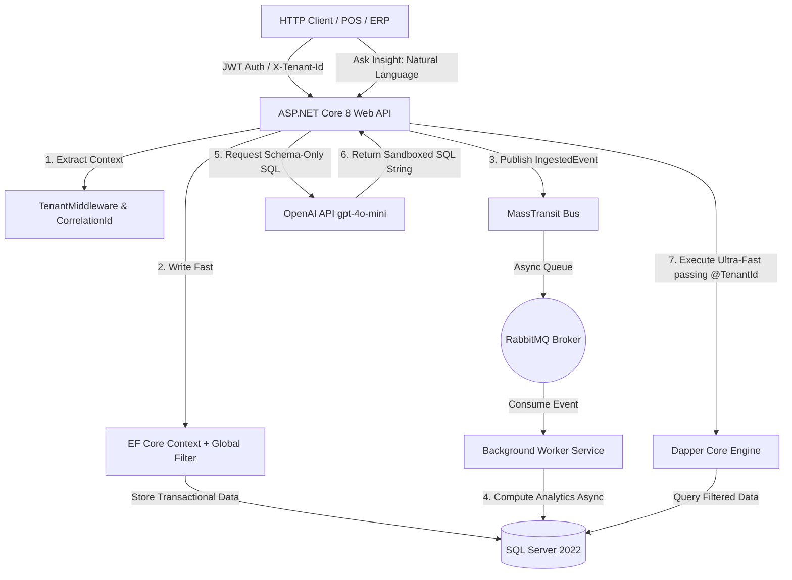

# Business Insights AI Platform 🚀

Advanced B2B SaaS Multi-Tenant Platform built with **.NET 8**, **Clean Architecture**, **SQL Server**, **MassTransit/RabbitMQ**, and **Secure Applied AI**.

## 📐 Architecture Diagram



## 🚀 Quick Start

You can run the entire infrastructure, including the database and message broker, locally with a single command:

```bash

docker compose up --build -d

```

## Infrastructure Services Available Locally

- SQL Server: `localhost,1433`

- RabbitMQ Management Portal: `http://localhost:15672`

- RabbitMQ credentials: `guest / guest`

- Swagger API Documentation: `http://localhost:<port>/swagger`

## 🧠 Key Senior Highlights Demonstrated

### Zero Data Leakage

Built-in dynamic Global Query Filters applied at the EF Core level help enforce tenant isolation and reduce the risk of cross-tenant data exposure.

### Hybrid Performance

The platform uses Entity Framework Core for safe transactional writes and Dapper for optimized analytical reads.

### Distributed Observability

Structured telemetry is implemented with Serilog and a consistent `CorrelationId` across HTTP requests, enabling easier troubleshooting and request tracing.

### Asynchronous Processing

MassTransit and RabbitMQ decouple heavy background processing from the Web API request lifecycle, allowing the API to respond quickly while workers process analytical tasks asynchronously.
